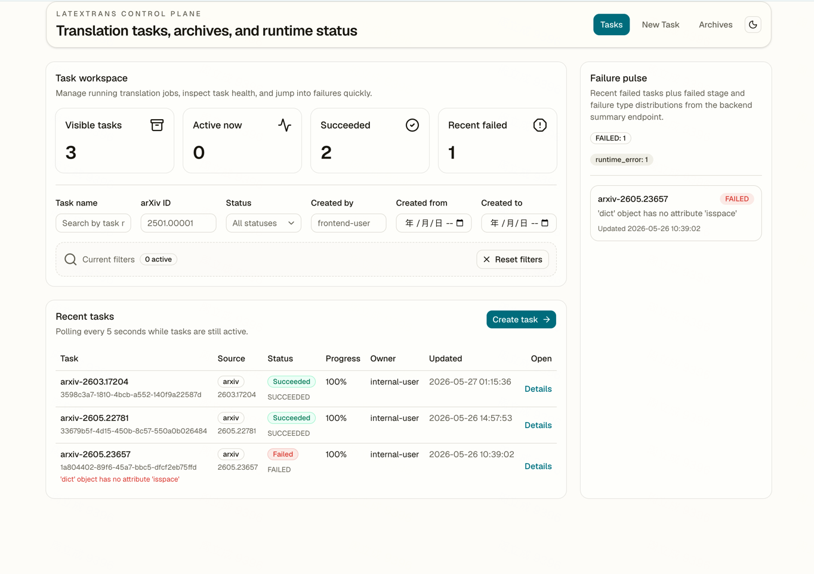
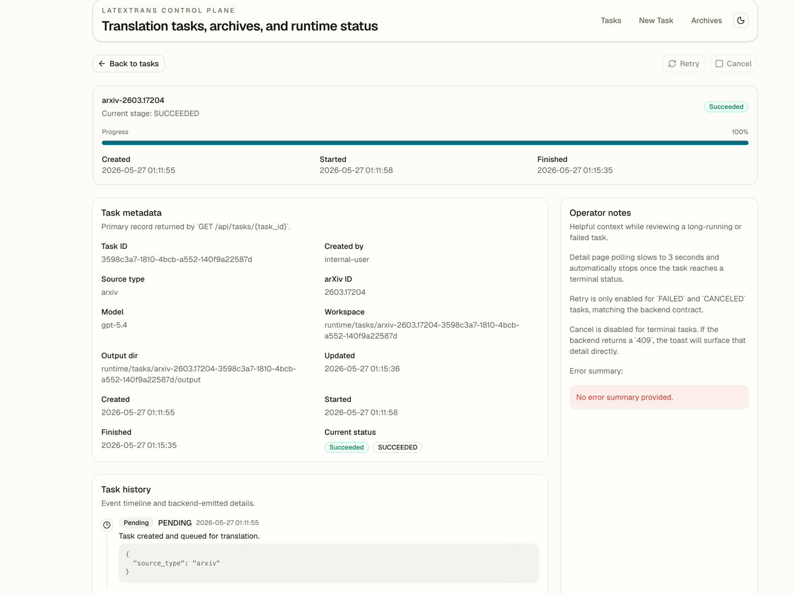
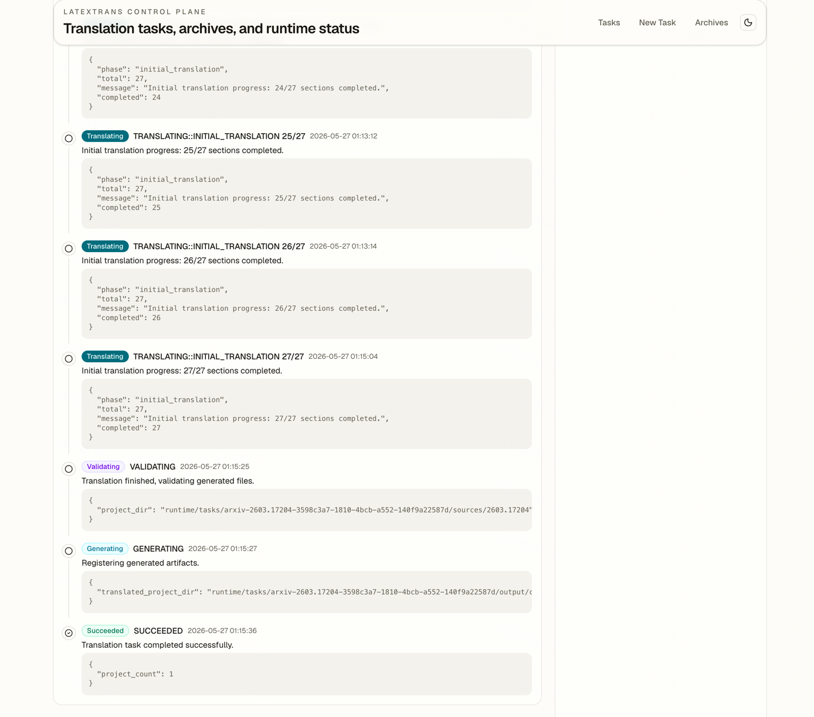
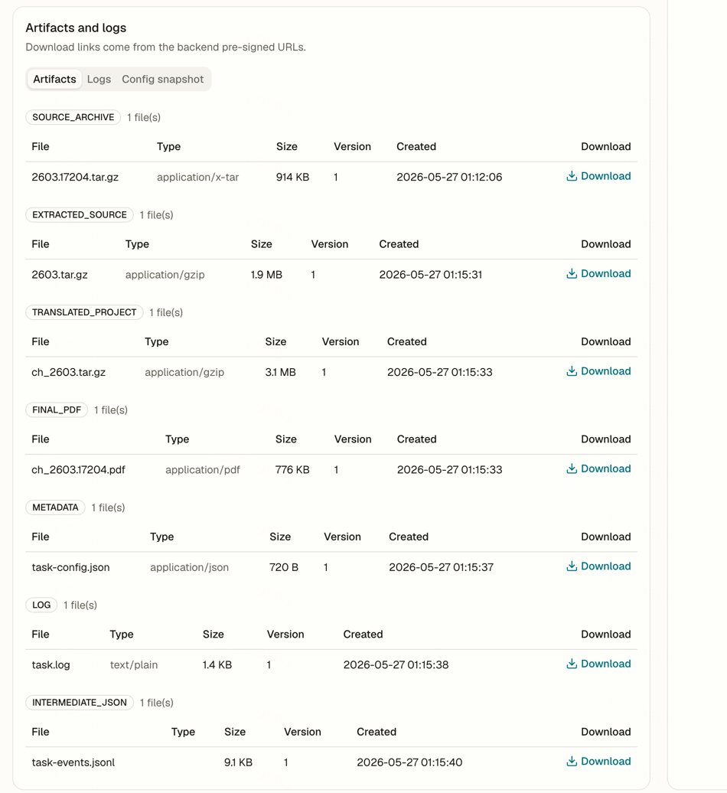
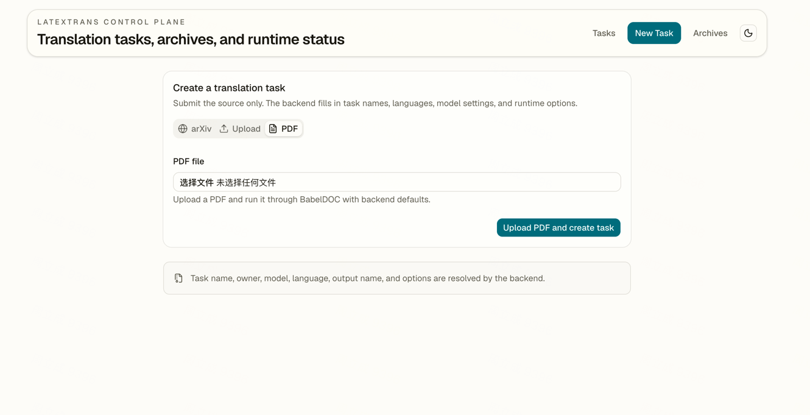
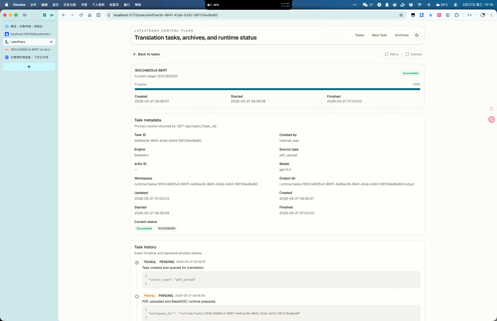
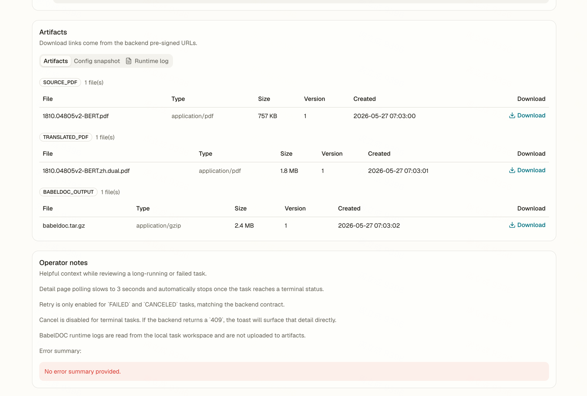
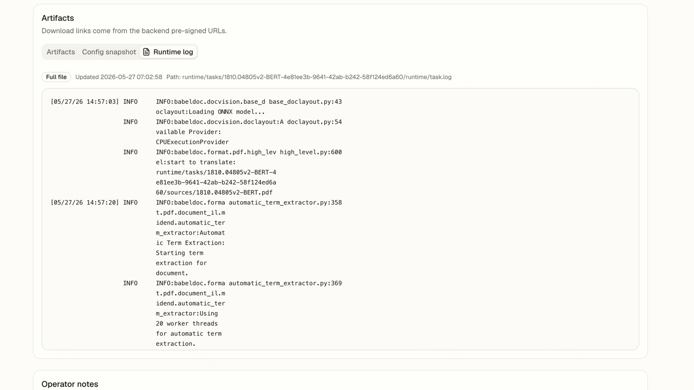

 This repository is a fork-based engineering adaptation. The original README content is kept below.

 Original repository: [NiuTrans/LaTeXTrans](https://github.com/NiuTrans/LaTeXTrans)

 Main changes in this fork:
 1. Switched model invocation to LangChain + OpenAI Responses API.
 2. Replaced TOML-based runtime config with `.env`-based configuration.
 3. Refactored into frontend-backend separation and introduced database-backed task management.
 4. Added task runtime persistence, artifact management, and MinIO uploads for outputs.
 5. Integrated with babeldoc, can  directly translate pdf

 `.env` config example reference [.env.example](.env.example)

## Unified Docker Deployment

Build the image from the repository root:

```bash
docker build -t latex-trans-prod .
```

Run the backend API and bundled frontend together on port `8000`:

```bash
docker run --rm -p 8000:8000 --env-file .env latex-trans-prod
```

If you want the container to also start the discovery Huey consumer, make sure these env vars are present in `.env`:

```env
DISCOVERY_HUEY_ENABLED=true
REDIS_URL=redis://host.docker.internal:6379/1
```

The container entrypoint now uses `./start.sh`, which:

1. Starts the FastAPI API server
2. Starts the discovery Huey consumer when `DISCOVERY_HUEY_ENABLED=true`

Optional consumer tuning env vars:

```env
DISCOVERY_HUEY_WORKERS=2
DISCOVERY_HUEY_WORKER_TYPE=thread
```

After the container starts:

- Frontend UI: `http://127.0.0.1:8000/`
- Backend API: `http://127.0.0.1:8000/api`
- OpenAPI docs: `http://127.0.0.1:8000/api/docs`

## Local Backend + Consumer Run

For discovery periodic jobs and async manual triggers, you need both the API server and the Huey consumer.

Recommended `.env` entries:

```env
DISCOVERY_HUEY_ENABLED=true
REDIS_URL=redis://127.0.0.1:6379/1
```

Start the API server from the repo root:

```bash
.venv/bin/uvicorn backend.app.main:app --host 0.0.0.0 --port 8000
```

Start the discovery consumer in another terminal:

```bash
.venv/bin/huey_consumer -w 2 -k thread backend.app.workers.discovery_schedule.huey
```

Verbose mode:

```bash
.venv/bin/huey_consumer -w 2 -k thread -v backend.app.workers.discovery_schedule.huey
```

Behavior notes:

- `POST /api/admin/discovery/sync` with `DISCOVERY_HUEY_ENABLED=true` will enqueue the run to Huey.
- If `DISCOVERY_HUEY_ENABLED=false`, manual discovery sync falls back to inline execution.
- The periodic scheduler also runs inside the same Huey consumer process.


## UI Example










<div align="center">

English | [中文](README_ZH.md)


</img>

  **Turn arXiv Papers into Multilingual Masterpieces**
#
<!-- <p align="center">
  <a href="https://arxiv.org/abs/2503.06594" alt="paper"></a>
</p> -->

</div>

<div align="center">
<p dir="auto">

• 📖 [Introduction](#-introduction) 
• 🛠️ [Installation Guide](#️-installation-guide) 
• ⚙️ [Configuration Guide](#️-configuration-guide)
• 📚 [Usage](#-Usage)
• 🖼️ [Translation Examples](#️-translation-examples) 

</p>
</div>

 End-to-end translation from arXiv paper ID to translated PDF. LaTeXTrans have the following **Features** :
 - **🌟 Preserve the integrity of formulas, layout, and cross-references**
 - **🌟 Ensure consistency in terminology translation**
 - **🌟 Support end-to-end conversion from original TeX source (automatically downloaded based on the arXiv paper id provided) to translated PDF**

With LaTeXTrans, researchers and students can obtain higher-quality arXiv paper translations without worrying about formatting confusion or missing content, thus reading and understanding arXiv papers more efficiently.

# 📖 Introduction

LaTeXTrans is a structured LaTeX document translation system based on multi-agent collaboration. It directly translates LaTeX code and generates translated PDFs with high fidelity to the original layout. Unlike traditional document translation methods (e.g., PDF translation), which often break formulas and formatting, LaTeXTrans leverages LLM to translate preprocessed LaTeX sources and employs a workflow composed of six agents—Parser, Translator, Validator, Summarizer, Terminology Extractor, and Generator to achieve the features. The figure below illustrates the system architecture of LaTeXTrans. 
<!-- For a more detailed introduction, please refer to our published paper 🔗 [LaTeXTrans: Structured LaTeX Translation with Multi-Agent Coordination](https://arxiv.org/abs/2508.18791). -->

<!-- </img> -->


# 🛠️ Installation Guide

#### 1. Clone Repository

```bash
git clone https://github.com/PolarisZZM/LaTeXTrans.git
cd LaTeXTrans
pip install -r requirements.txt
```

#### 2. Install MikTex(Recommended) or TeXLive

If you need to compile LaTeX files (e.g., generate PDF output), install [MikTex](https://miktex.org/download) or [TeXLive](https://www.tug.org/texlive/) !

 > [!IMPORTANT]
For MikTex, installation please be sure to select "install on the fly", in addition, you need to install additional [Strawberry Perl](http://strawberryperl.com/) support compilation.

# ⚙️ Configuration Guide

### Local Configuration

Please edit the configuration file before use:

```arduino
config/default.toml
```

Set the language model's API key and base URL in default.toml :

```toml
model = " " # model name (For example, deepseek-chat)
api_key = " " # your_api_key_here
base_url = " " # base url of the API (For example, https://api.deepseek.com/v1/chat/completions)
```

 > [!NOTE]
The following example shows the recommended base_url for different models:

| Model |base_url| 
|:-|:-|
|deepseek-chat|https://api.deepseek.com/v1/chat/completions|
|gpt-4o|https://api.openai.com/v1/chat/completions|
|gemini-2.5-pro|https://generativelanguage.googleapis.com/v1beta/openai/chat/completions|

# 📚 Usage

###  Translation via ArXiv ID 

Simply provide an arXiv paper ID to complete translation:

```bash
python main.py --arxiv ${xxxx}
# For example, 
# python main.py --arxiv 2508.18791
```

This command will:

1. Download the LaTeX source code from arXiv and extract it
2. Execute a workflow consisting of parsing, translation, refactoring and compilation
3. Save the translated LaTeX project file of the paper and the PDF of the compiled translation in the outputs folder

 > [!NOTE]
Although LaTeXTrans supports translation from any language to any language, the current version has only made relatively complete compilation adaptations for translation from English to Chinese. When translating to other languages, the final output pdf may contain errors. We welcome you to raise an issue to describe the problem you have encountered, and we will solve it case by case.

<!-- # 🧰 Experimental Results

| System | COMETkiwi | LLM-score | FC-score | Cost |
|:-|:-:|:-:|:-:|:-:|
|NiuTrans |64.69|7.93|60.72|-|
|Google Translate |46.23|5.93|51.00|-|
|LLaMA-3.1-8b|42.89|2.92|49.40|-|
|Qwen-3-8b|45.55|7.87|48.68|-|
|Qwen-3-14b|68.18|8.76|65.63|-|
|DeepSeek-V3|67.26|**9.02**|63.68|$0.02|
|GPT-4o|67.22|8.58|58.32|$0.13|
|**LaTeXTrans(Qwen-3-14b)**|71.37|8.97|71.20|-|
|**LaTeXTrans(DeepSeek-V3)**|73.48|9.01|70.52|$0.10|
|**LaTeXTrans(GPT-4o)**|**73.59**|8.92|**71.52**|$0.35|

Note:
- **COMETkiwi** : a quality estimation model ([wmt22-cometkiwi-da](https://huggingface.co/Unbabel/wmt22-cometkiwi-da)) that reflects the quality of the translation, the higher the score, the better the translation quality.
- **LLM-score** : a method for evaluating the quality of translation using LLM (GPT-4o), the higher the score, the better the translation quality.
- **FC-score** : a method proposed in our paper to evaluate the formatting ability of LaTeX translation by detecting the number of errors in the compiled logs, the higher the score, the better the ability to maintain format.
- **Cost** : the average cost of translating each paper using the official API. -->
  


# 🖼️ Translation Examples

The following are three real translation examples generated by **LaTeXTrans**, with the original text on the left and translation results on the right.

### 📄 Case 1 ( en->ch ) :

<table>
  <tr>
    <td align="center"><b>Original</b></td>
    <td align="center"><b>Translation</b></td>
  </tr>
  <tr>
    <td></td>
    <td></td>
  </tr>
</table>

### 📄 Case 2 ( en->ch ):

<table>
  <tr>
    <td align="center"><b>Original</b></td>
    <td align="center"><b>Translation</b></td>
  </tr>
  <tr>
    <td></td>
    <td></td>
  </tr>
</table>

### 📄 Case 3 ( en->jp ):

<table>
  <tr>
    <td align="center"><b>Original</b></td>
    <td align="center"><b>Translation</b></td>
  </tr>
  <tr>
    <td></td>
    <td></td>
  </tr>
</table>

### 📄 Case 4 ( en->jp ):

<table>
  <tr>
    <td align="center"><b>Original</b></td>
    <td align="center"><b>Translation</b></td>
  </tr>
  <tr>
    <td></td>
    <td></td>
  </tr>
</table>


📂 **See [`examples/`](examples/) folder for more cases**, including complete translation PDFs for each case.

---
## Citation
```bash
@article{zhu2025latextrans,
  title={LaTeXTrans: Structured LaTeX Translation with Multi-Agent Coordination},
  author={Zhu, Ziming and Wang, Chenglong and Xing, Shunjie and Huo, Yifu and Tian, Fengning and Du, Quan and Yang, Di and Zhang, Chunliang and Xiao, Tong and Zhu, Jingbo},
  journal={arXiv preprint arXiv:2508.18791},
  year={2025}
}
